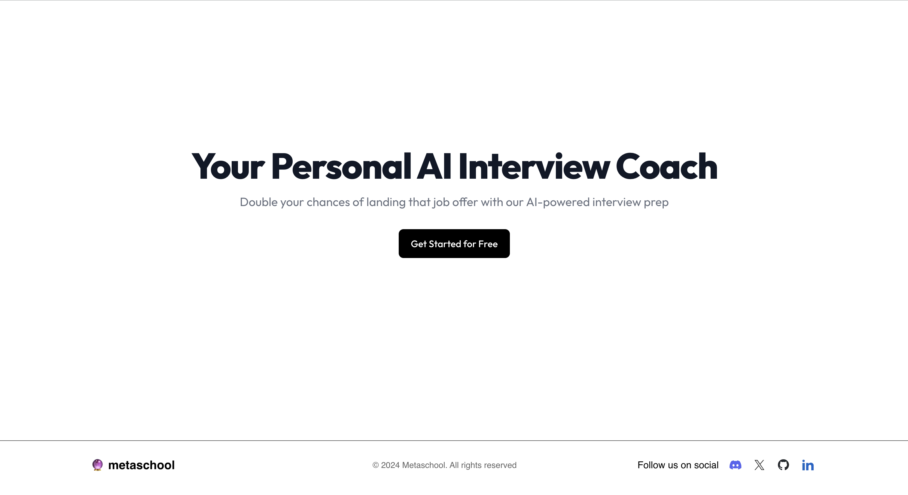
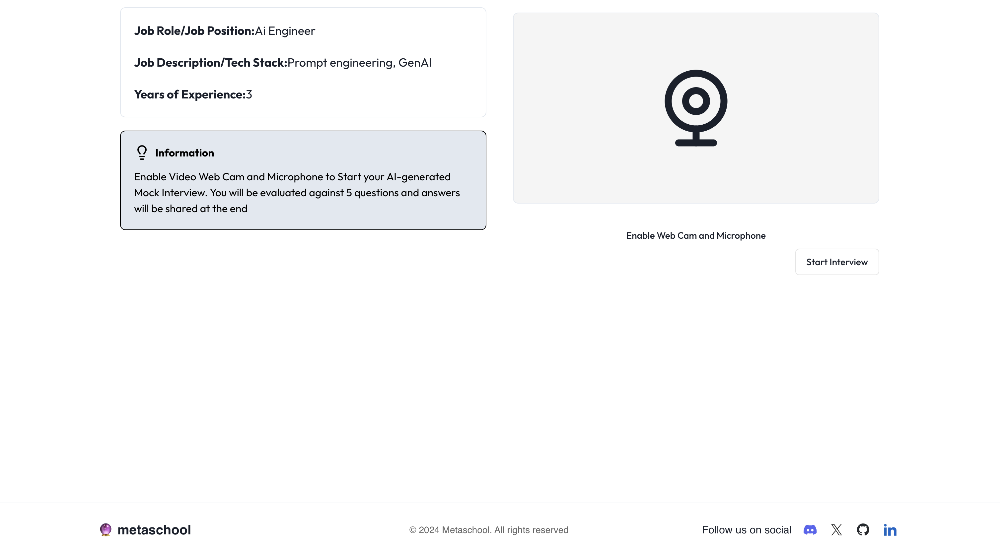
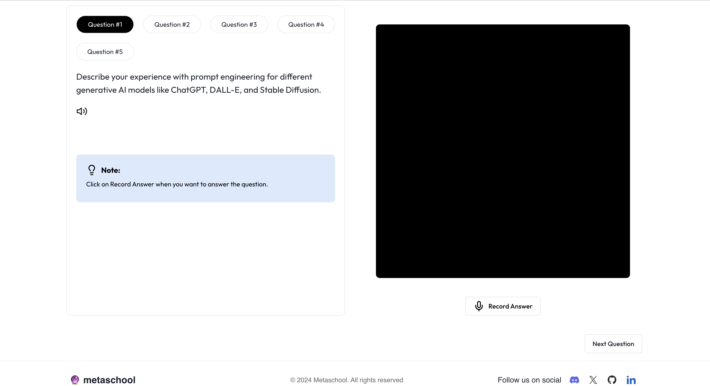

## AI_Mock_Interviewer

An AI-powered simulator that offers personalized online interview experiences. It takes voice input and provides instant feedback to help you improve.

## Table of Contents

- [Live Demo](#live-demo)
- [Features](#features)
- [Technologies Used](#technologies-used)
- [Getting Started](#getting-started)
  - [Prerequisites](#prerequisites)
  - [How to run the project](#how-to-run-the-project)
- [Screenshots](#screenshots)
- [How to use the application](#how-to-use-the-application)
- [Use case](#use-case)
- [Contributing](#contributing)
- [License](#license)
- [Acknowledgements](#acknowledgements)
- [Contact](#contact)

## Live Demo

https://final-ai-mock-interview.vercel.app/

## Features
- Secure access with social login or email/password authentication.
- Generate AI-Powered interview questions based on the provided interview details.
- Converts user responses into text, enabling seamless interaction.
- Provides AI-driven analysis and feedback based on user interview responses.

## Technologies Used
- Next.js
- React
- Drizzle ORM
- Gemini AI
- Clerk


## Getting Started


**Prerequisites**

- Next.js
- Clerk credentials
- Gemini API Key

**How to run the project**

1. Clone the repository:
    ```bash
    git clone git clone https://github.com/0xmetaschool/ai-mock-interview.git
    ```

2. Navigate to the project directory:
    ```bash
    cd AI_Mock_Interviewer
    ```

3. Install dependencies:
    ```bash
    npm install
    ```

4. Set up environment variables:
   Create a .env file in the root directory as `.env.local` with the following environment variables:

    ```bash
    NEXT_PUBLIC_CLERK_PUBLISHABLE_KEY=
    CLERK_SECRET_KEY=
    NEXT_PUBLIC_CLERK_SIGN_IN_URL=
    NEXT_PUBLIC_CLERK_SIGN_UP_URL=
    NEXT_PUBLIC_DRIZZLE_DB_URL=
    sslmode=
    NEXT_PUBLIC_GEMINI_API_KEY=
    NEXT_PUBLIC_INTERVIEW_QUESTION_COUNT=
    NEXT_PUBLIC_INFORMATION=
    NEXT_PUBLIC_QUESTION_NOTE=
    ```
   
5. Run the development server:
    ```bash
    npm run dev
    ```

6. Run the development server:

Open the browser and go to `http://localhost:3000`. Ensure that everything is loading and the live preview works as expected.

## Screenshots


<div style="display: flex; justify-content: space-between;">
  
  
</div>

<div style="margin-top: 10px;">
  
</div>


## How to use the application

1. Sign-in using Google, email or facebook account.
2. Add a new interview and provide job role, description and years of experience.
3. Respond to AI-generated questions and record them for the feedback.
4. The AI will evaluate the answers and provide you a complete feedback.
5. History of user interviews are saved on dashboard and a User can re-attempt the existing interviews from the dashboard as well.


## Contributing

We love contributions! Here's how you can help make the AI-powered FinanceGuru even better:

1. Fork the project (`gh repo fork https://github.com/0xmetaschool/ai-mock-interview.git`)
2. Create your feature branch (`git checkout -b feature/AmazingFeature`)
3. Commit your changes (`git commit -m 'Add some AmazingFeature'`)
4. Push to the branch (`git push origin feature/AmazingFeature`)
5. Open a Pull Request

## License
This project is licensed under the MIT License - see the [LICENSE file](./LICENSE) for details.


## Acknowledgments

- Google Gemini for providing the API
- Clerk for authenticating the login process
- Drizzle ORM for allowing to setup the database and stremline the process

## Contact

Please open an issue in the GitHub repository for any queries or support.
